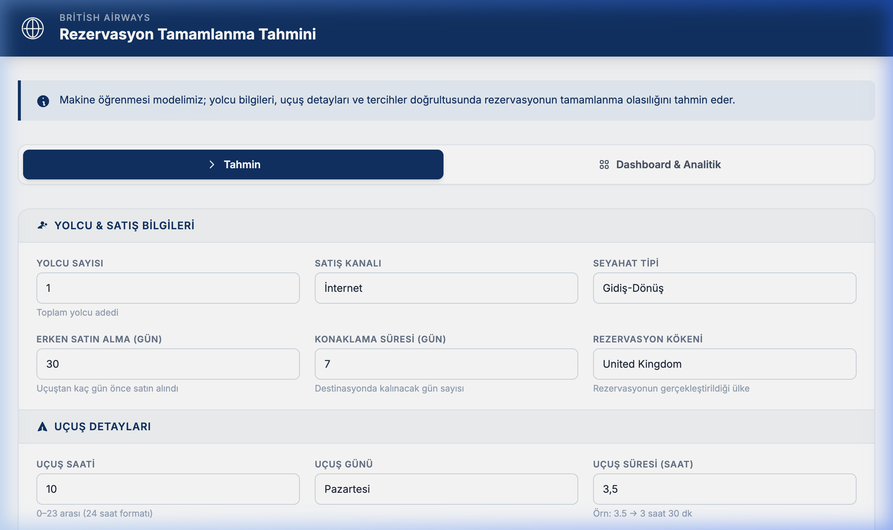
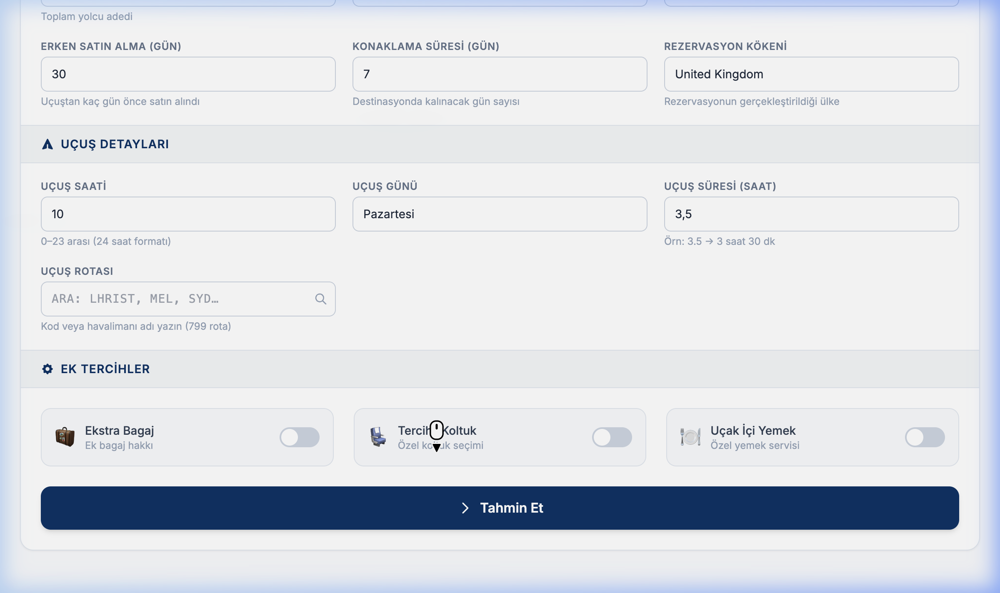
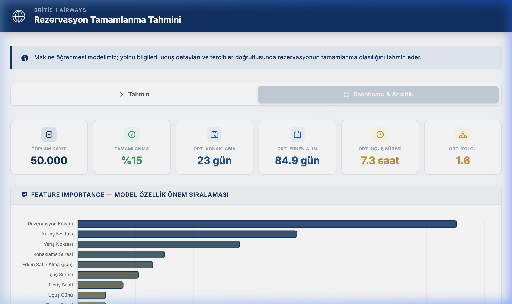
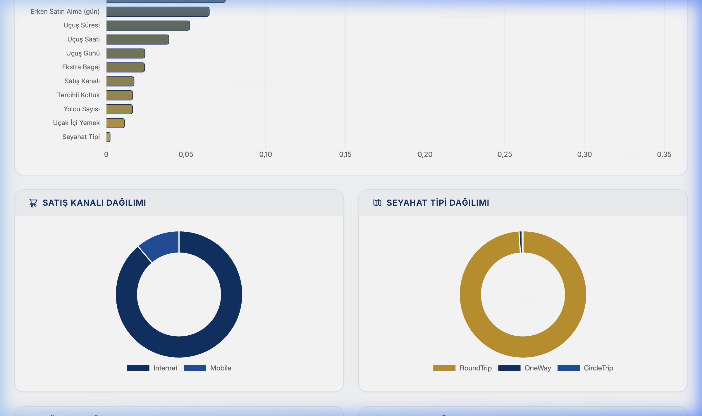
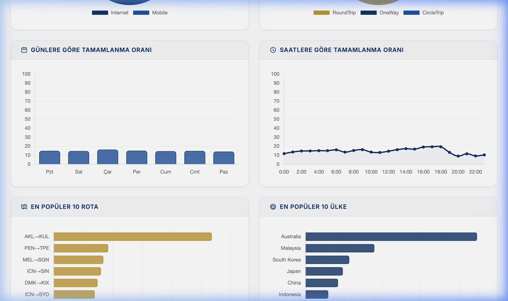
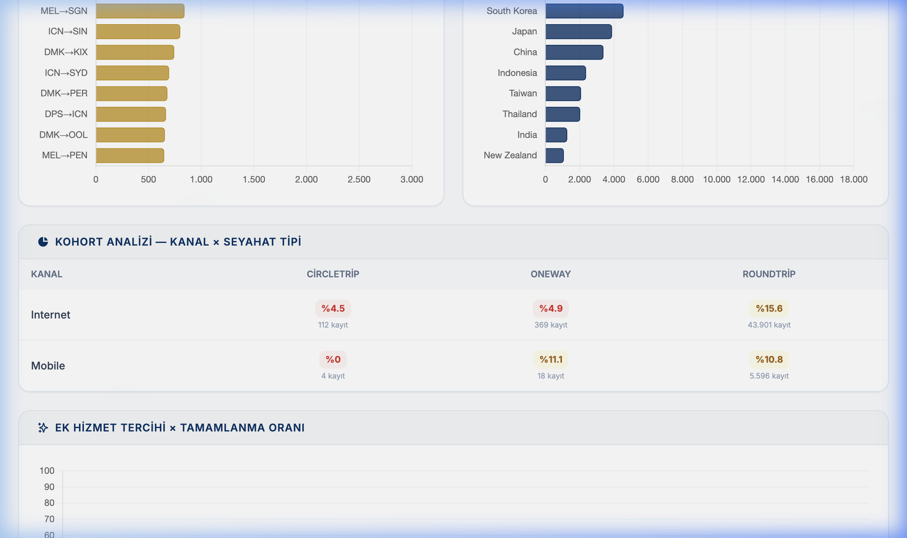
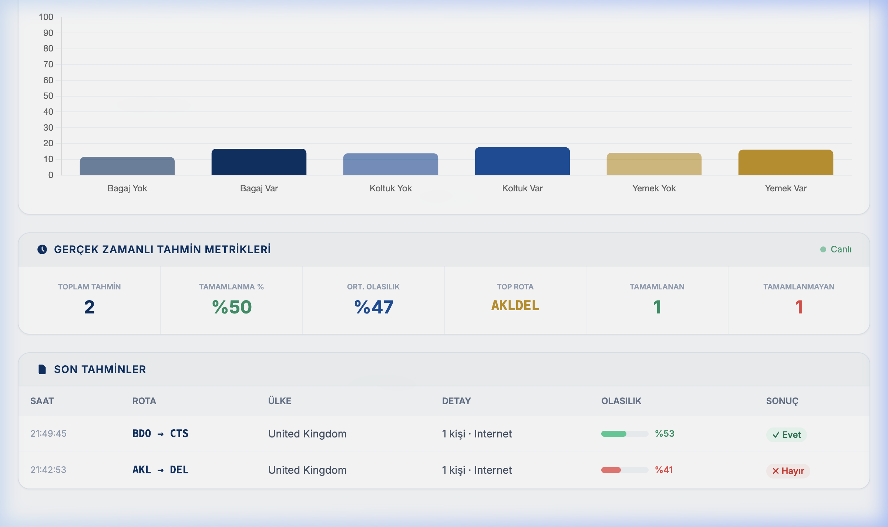

# ✈️ British Airways — Booking Completion Prediction

<div align="center">


**A machine learning–powered customer booking completion prediction system with an interactive analytics dashboard.**

[Quick Start](#-quick-start) · [Features](#-features) · [Screenshots](#-screenshots) · [API Reference](#-api-reference)

</div>

---

## 📋 About

This application predicts whether a British Airways customer will **complete** their flight booking using a **RandomForestClassifier** trained on a real-world dataset of 50,000 booking records. Users can input passenger details, flight information, and service preferences through a polished web interface and receive an instant probability estimate.

In addition to predictions, the app provides a full **analytics dashboard** with KPI cards, distribution charts, feature importance rankings, cohort analysis, and real-time prediction tracking.

### Key Components

| Component | Description |
|-----------|-------------|
| **Prediction Engine** | RandomForest binary classifier (completes / does not complete) |
| **Web Interface** | Responsive form + interactive dashboard (Tailwind CSS + Chart.js) |
| **Backend API** | RESTful services built with FastAPI |
| **Analytics Dashboard** | 10+ interactive charts, cohort analysis, live metrics |

---

## 🚀 Features

### 🎯 Prediction System
- Real-time **booking completion probability** based on customer & flight data
- Autocomplete route search across 6,000+ routes
- Visual result card with probability gauge, confidence score, and decision explanation
- Form validation with user-friendly error messages

### 📊 Analytics Dashboard
- **KPI Cards** — Total records, completion rate, average stay / lead time / flight duration / passengers
- **Feature Importance** — Horizontal bar chart ranking model feature contributions
- **Sales Channel & Trip Type** — Interactive doughnut distribution charts
- **Day & Hour Trends** — Completion rate bar and line charts by day of week and hour
- **Top 10 Routes & Countries** — Horizontal bar charts for most popular routes and booking origins
- **Cohort Analysis** — Channel × Trip Type heatmap table with completion rates
- **Extra Services** — Baggage / Seat / Meal preference vs. completion rate comparison

### ⚡ Real-Time Metrics
- Live prediction counters with 10-second auto-refresh
- Recent predictions feed — time, route, country, probability, outcome
- Completed vs. not-completed distribution stats

---

## 📸 Screenshots

### Prediction Form
> Enter passenger information, flight details, and preferences to get an instant booking completion probability.





---

### Analytics Dashboard — KPIs & Feature Importance
> Key performance indicators at a glance plus model feature importance ranking.



---

### Distribution & Trend Analysis
> Sales channel and trip type distributions, completion rates by day and hour, top routes and countries.





---

### Cohort Analysis & Extra Services
> Cohort heatmap broken down by channel and trip type, plus extra service comparison.



---

### Real-Time Metrics & Recent Predictions
> Live prediction metrics and a feed of recent prediction results with probability bars.



---

## 🏗️ Project Structure

```
BritishAirwaysBookingModel/
├── app.py                      # FastAPI backend & API endpoints
├── model_tests.py              # Model training & evaluation script
├── requirements.txt            # Python dependencies (pinned versions)
├── british_airways_model.pkl   # Trained RandomForest model (*)
├── data/
│   └── customer_booking.csv    # Raw dataset — 50K records (*)
├── templates/
│   └── index.html              # Main web UI (Jinja2 template)
├── static/
│   └── dashboard.js            # Dashboard charts & analytics JS
├── screenshots/                # App screenshots for README
├── .gitignore
└── README.md
```

> (*) `british_airways_model.pkl` and `data/customer_booking.csv` are excluded from version control due to their size. See the [Quick Start](#-quick-start) section for setup instructions.

---

## 💻 Quick Start

### Prerequisites
- Python 3.10+
- pip

### Installation

```bash
# 1. Clone the repository
git clone https://github.com/<your-username>/BritishAirwaysBookingModel.git
cd BritishAirwaysBookingModel

# 2. Create and activate a virtual environment
python -m venv .venv
source .venv/bin/activate        # macOS / Linux
# .venv\Scripts\activate         # Windows

# 3. Install dependencies
pip install -r requirements.txt

# 4. Add the dataset and model
# Place british_airways_model.pkl in the project root directory
# and customer_booking.csv inside the data/ folder.
# (These files are excluded from the repo due to size)

# 5. (Optional) Train the model from scratch
python model_tests.py

# 6. Start the server
uvicorn app:app --host 0.0.0.0 --port 8000

# 7. Open in your browser
# http://localhost:8000
```

---

## 🔌 API Reference

| Method | Endpoint | Description |
|--------|----------|-------------|
| `GET` | `/` | Main page (HTML) |
| `GET` | `/api/routes` | List all available routes |
| `POST` | `/predict` | Make a booking completion prediction |
| `GET` | `/api/analytics` | Dataset statistics and distributions |
| `GET` | `/api/feature-importance` | Model feature importance scores |
| `GET` | `/api/cohort` | Cohort analysis (channel × trip type) |
| `GET` | `/api/predictions/recent` | Recent prediction history |
| `GET` | `/api/metrics` | Real-time prediction metrics |

### Example Prediction Request

```bash
curl -X POST http://localhost:8000/predict \
  -H "Content-Type: application/x-www-form-urlencoded" \
  -d "num_passengers=2&sales_channel=Internet&trip_type=RoundTrip&purchase_lead=30&length_of_stay=7&flight_hour=14&flight_day=Cum&route=AKLDEL&booking_origin=United+Kingdom&flight_duration=3.5&wants_extra_baggage=1&wants_preferred_seat=0&wants_in_flight_meals=0"
```

---

## 📦 Tech Stack

| Layer | Technology |
|-------|-----------|
| **Backend** | [FastAPI](https://fastapi.tiangolo.com/) + [Uvicorn](https://www.uvicorn.org/) |
| **ML Model** | [scikit-learn](https://scikit-learn.org/) RandomForestClassifier |
| **Data Processing** | [pandas](https://pandas.pydata.org/), [NumPy](https://numpy.org/) |
| **Feature Encoding** | [category_encoders](https://contrib.scikit-learn.org/category_encoders/) (BinaryEncoder) |
| **Frontend** | HTML5, [Tailwind CSS](https://tailwindcss.com/) (CDN), [Chart.js](https://www.chartjs.org/) 4.4 |
| **Templating** | [Jinja2](https://jinja.palletsprojects.com/) |

---

## 👤 Author

**Mert Can Demir**

---

## 📄 License

This project was developed for educational purposes.
